## Part 1. Готовый докер

**== Задание ==**

- Взять официальный докер образ с **nginx** и выкачать его при помощи `docker pull`
  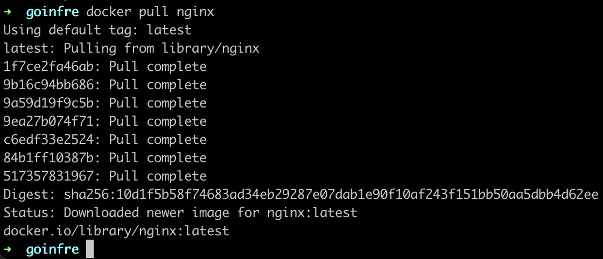
- Проверить наличие докер образа через `docker images`
  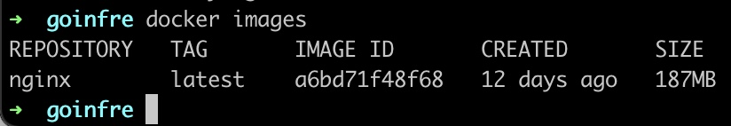
- Запустить докер образ через `docker run -d nginx`
  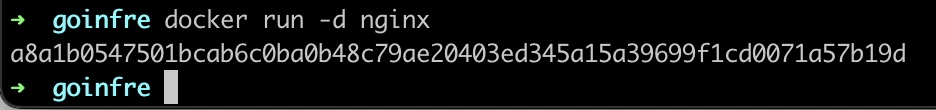
- Проверить, что образ запустился через `docker ps`
  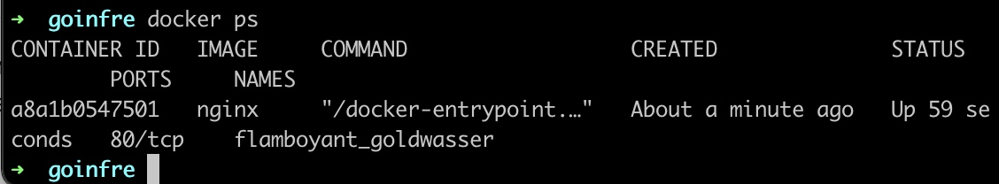
- Посмотреть информацию о контейнере через `docker inspect [container_id|container_name]`
  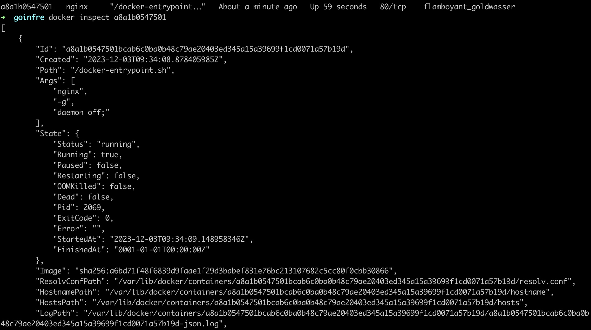
- По выводу команды определить и поместить в отчёт размер контейнера, список замапленных портов и ip контейнера
  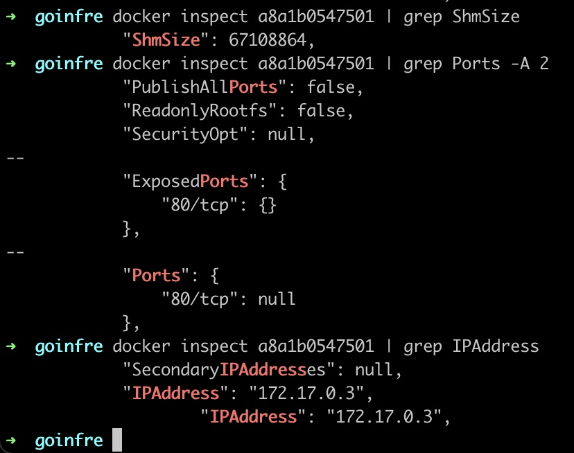
- Остановить докер образ через `docker stop [container_id|container_name]`
  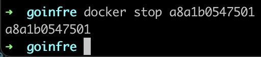
- Проверить, что образ остановился через `docker ps`
  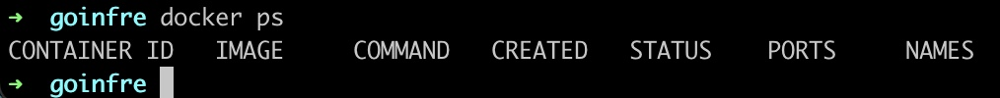
- Запустить докер с портами 80 и 443 в контейнере, замапленными на такие же порты на локальной машине, через команду *run*
  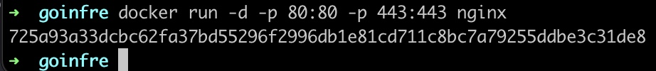
- Проверить, что в браузере по адресу *localhost:80* доступна стартовая страница **nginx**
  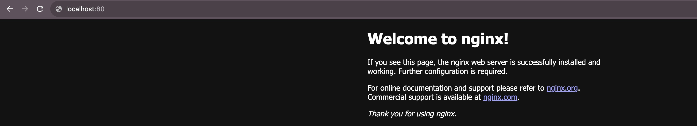
- Перезапустить докер контейнер через `docker restart [container_id|container_name]`
  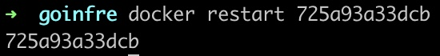
- Проверить любым способом, что контейнер запустился
  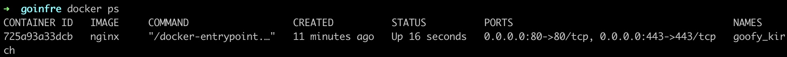

## Part 2. Операции с контейнером

**== Задание ==**

- Прочитать конфигурационный файл *nginx.conf* внутри докер контейнера через команду *exec*
  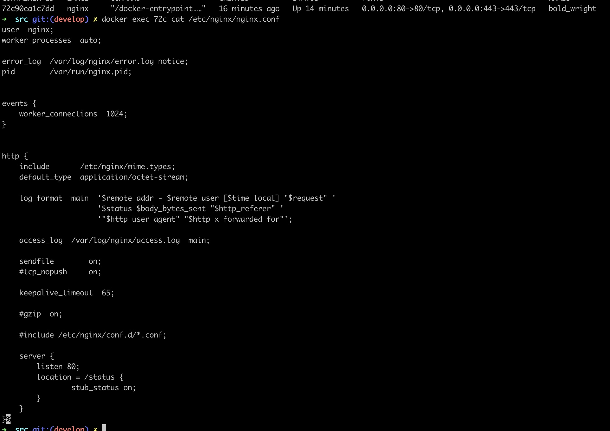
- Создать на локальной машине файл *nginx.conf* и настроить в нем по пути */status* отдачу страницы статуса сервера **nginx**. Также необходиммо заккоментировать строку `include /etc/nginx/conf.d/*.conf;` чтобы не брать настройки из дефолтного файла
  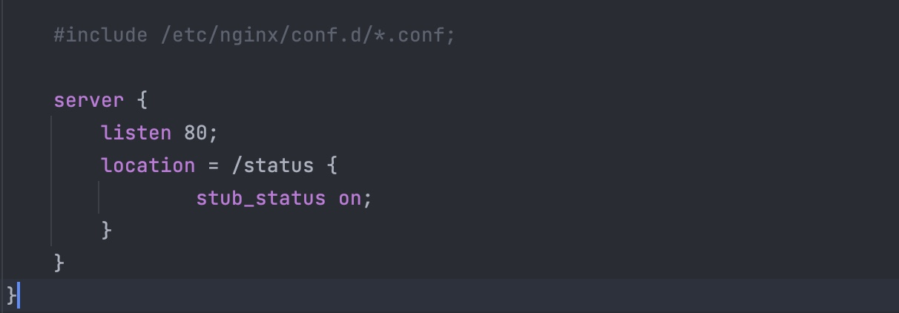
- Скопировать созданный файл *nginx.conf* внутрь докер образа через команду `docker cp` и перезапустить **nginx** внутри докер образа через команду *exec*
  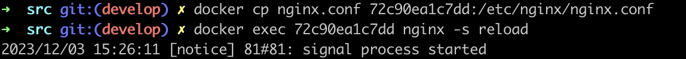
- Проверить, что по адресу *localhost:80/status* отдается страничка со статусом сервера **nginx**
  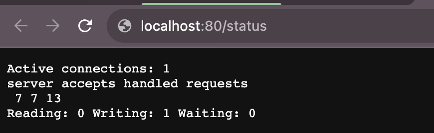
- Экспортировать контейнер в файл *container.tar* через команду *export*
  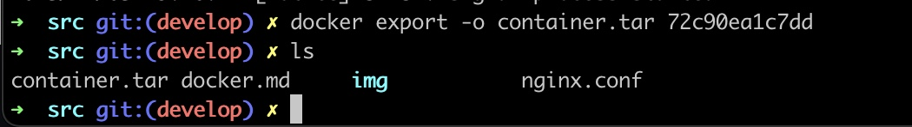
- Остановить контейнер
  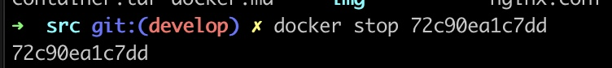
- Удалить образ через `docker rmi [image_id|repository]`, не удаляя перед этим контейнеры. Так как докер не позволяет удалить образ если его используют контейнеры, то используем флаг -f
  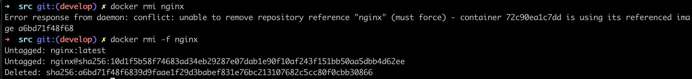
- Удалить остановленный контейнер
  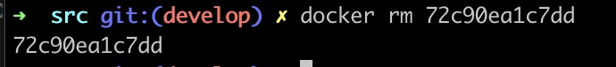
- Импортировать контейнер обратно через команду *import*, так как эта команда не включает в себя инструкции для установки команд по умолчанию, то дополнительно прописываем команды
  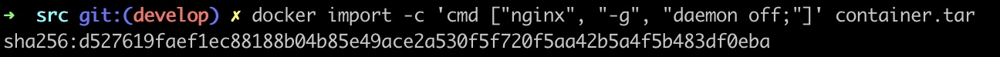
- Запустить импортированный контейнер
  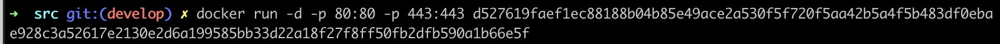
- Проверить, что по адресу *localhost:80/status* отдается страничка со статусом сервера **nginx**
  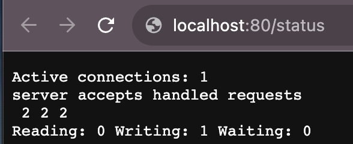

## Part 3. Мини веб-сервер

**== Задание ==**

##### Написать мини сервер на **C** и **FastCgi**, который будет возвращать простейшую страничку с надписью `Hello World!`
##### Запустить написанный мини сервер через *spawn-fcgi* на порту 8080
##### Написать свой *nginx.conf*, который будет проксировать все запросы с 81 порта на *127.0.0.1:8080*
##### Проверить, что в браузере по *localhost:81* отдается написанная вами страничка
##### Положить файл *nginx.conf* по пути *./nginx/nginx.conf* (это понадобится позже)

## Part 4. Свой докер

Теперь всё готово. Можно приступать к написанию докер образа для созданного сервера.

**== Задание ==**

*При написании докер образа избегайте множественных вызовов команд RUN*

#### Написать свой докер образ, который:
##### 1) собирает исходники мини сервера на FastCgi из [Части 3](#part-3-мини-веб-сервер)
##### 2) запускает его на 8080 порту
##### 3) копирует внутрь образа написанный *./nginx/nginx.conf*
##### 4) запускает **nginx**.
_**nginx** можно установить внутрь докера самостоятельно, а можно воспользоваться готовым образом с **nginx**'ом, как базовым._

##### Собрать написанный докер образ через `docker build` при этом указав имя и тег
##### Проверить через `docker images`, что все собралось корректно
##### Запустить собранный докер образ с маппингом 81 порта на 80 на локальной машине и маппингом папки *./nginx* внутрь контейнера по адресу, где лежат конфигурационные файлы **nginx**'а (см. [Часть 2](#part-2-операции-с-контейнером))
##### Проверить, что по localhost:80 доступна страничка написанного мини сервера
##### Дописать в *./nginx/nginx.conf* проксирование странички */status*, по которой надо отдавать статус сервера **nginx**
##### Перезапустить докер образ
*Если всё сделано верно, то, после сохранения файла и перезапуска контейнера, конфигурационный файл внутри докер образа должен обновиться самостоятельно без лишних действий*
##### Проверить, что теперь по *localhost:80/status* отдается страничка со статусом **nginx**

## Part 5. **Dockle**

После написания образа никогда не будет лишним проверить его на безопасность.

**== Задание ==**

##### Просканировать образ из предыдущего задания через `dockle [image_id|repository]`
##### Исправить образ так, чтобы при проверке через **dockle** не было ошибок и предупреждений

## Part 6. Базовый **Docker Compose**

Вот вы и закончили вашу разминку. А хотя погодите...
Почему бы не поэкспериментировать с развёртыванием проекта, состоящего сразу из нескольких докер образов?

**== Задание ==**

##### Написать файл *docker-compose.yml*, с помощью которого:
##### 1) Поднять докер контейнер из [Части 5](#part-5-инструмент-dockle) _(он должен работать в локальной сети, т.е. не нужно использовать инструкцию **EXPOSE** и мапить порты на локальную машину)_
##### 2) Поднять докер контейнер с **nginx**, который будет проксировать все запросы с 8080 порта на 81 порт первого контейнера
##### Замапить 8080 порт второго контейнера на 80 порт локальной машины

##### Остановить все запущенные контейнеры
##### Собрать и запустить проект с помощью команд `docker-compose build` и `docker-compose up`
##### Проверить, что в браузере по *localhost:80* отдается написанная вами страничка, как и ранее

💡 [Нажми тут](https://forms.yandex.ru/cloud/6418195450569020f1f159c4/), **чтобы поделиться с нами обратной связью на этот проект**. Это анонимно и поможет команде Продукта сделать твоё обучение лучше.
